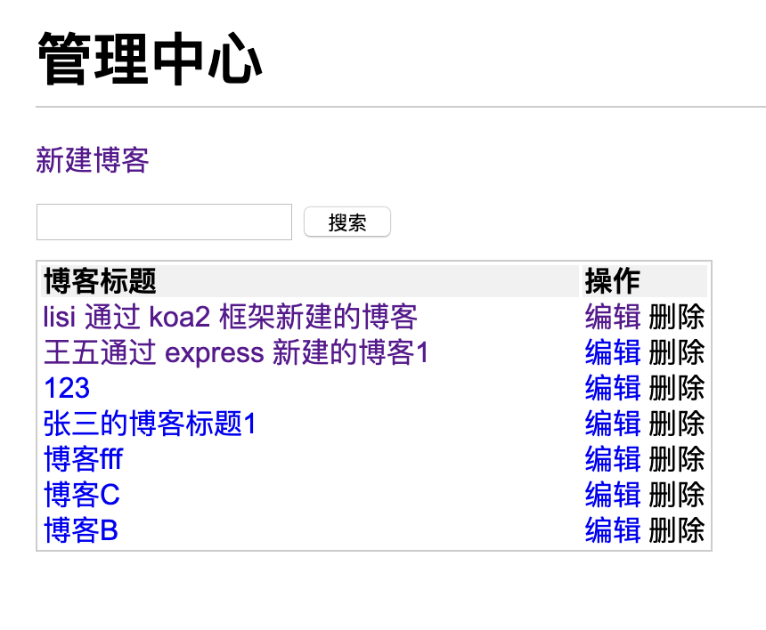
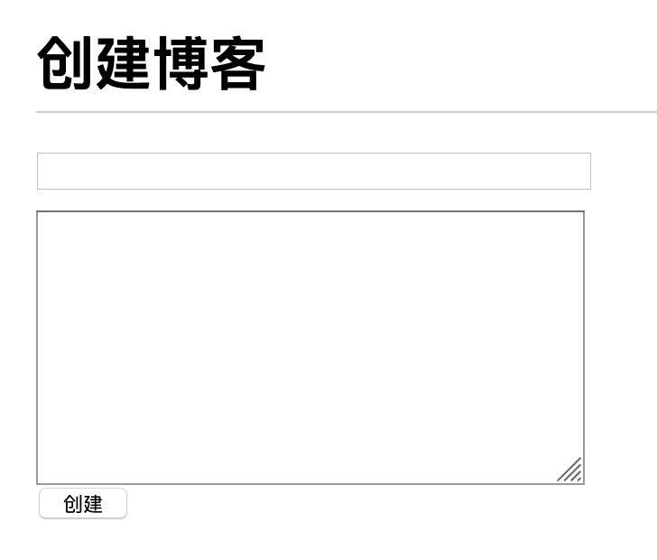
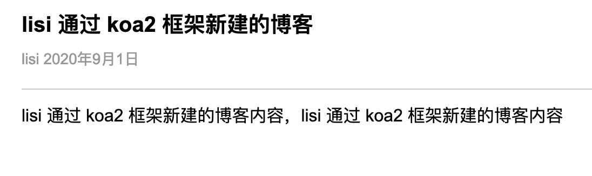
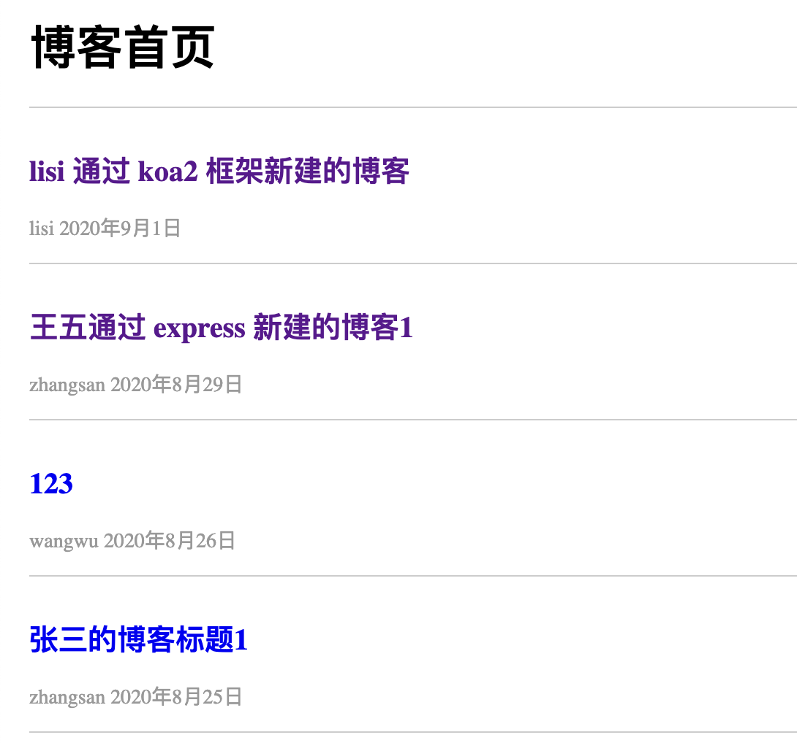

# 页面规划

## 登录页面

_功能界面描述_

- 表单（用户名，密码，登录按钮）

## 用户管理页面

_功能界面描述_

- 新建博客按钮
- 搜索输入框、搜索按钮
- 表格（序号，博客标题，作者，创建时间，最后更新时间，操作）
- 删除博客

## 创建博客/更新博客页面

_功能界面描述_

- 表单（博客标题、博客内容）

## 博客详情页

_功能界面描述_

- 内容描述（标题、作者、创建时间、博客内容）

## 首页

_功能界面描述_

- 列表（标题、作者、时间）

